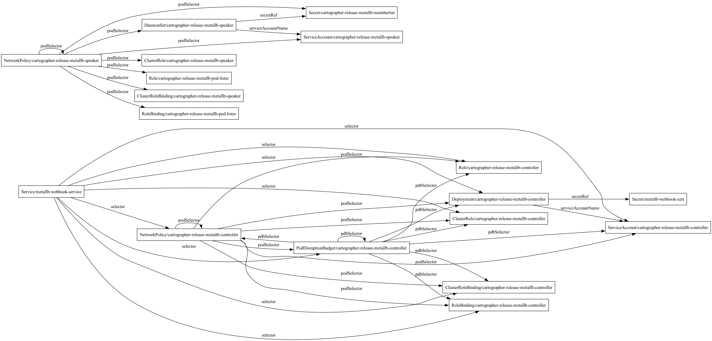

# Cartographer

Cartographer is a lightweight CLI tool written in Go that analyzes and visualizes relationships between Kubernetes resources. It ingests Kubernetes manifests—either from YAML files or via the Helm SDK—and produces dependency graphs in multiple formats (DOT, Mermaid, JSON, PNG, SVG) to help you understand and document your application's architecture.

## Features

- **Kubernetes Manifest Ingestion**  
  - Parse multi-document YAML files and convert them into structured Kubernetes objects for analysis.
  - Support for ephemeral containers, environment variable references, volume references (Secrets, ConfigMaps, PVCs), and more.

- **Helm Chart Support**  
  - Render and analyze Kubernetes manifests from Helm charts via the Helm SDK.
  - Specify the chart path similarly to Helm CLI usage (e.g., `--chart`, `--release`, `--values`, `--version`).

- **Dependency Analysis with Labeled Edges**  
  - Detect references such as:
    - **Owner References** (e.g., Deployment owned by a HelmRelease).
    - **Pod Spec References** (Secrets, ConfigMaps, PVCs, ServiceAccounts, imagePullSecrets).
    - **Label Selectors** (Service → Pod, NetworkPolicy → Pod, PodDisruptionBudget → Pod), including full `matchExpressions` support (In, NotIn, Exists, DoesNotExist).
    - **Ingress** routes (Ingress → Service → TLS Secret).
    - **HPA** scale targets (HPA → Deployment).
  - Each edge is annotated with a **reason** (e.g., `ownerRef`, `secretRef`, `selector`) to clarify how resources are connected.

- **Multiple Output Formats**
  - DOT, Mermaid, JSON, PNG, and SVG output formats.
  - Mermaid renders natively in GitHub READMEs, Notion, and Confluence.
  - PNG and SVG render directly via built-in GraphViz integration.
  - JSON output for integration with other tools and CI pipelines.
  - Edges are automatically labeled with the reference reason, making the graph easy to interpret.

- **Cobra & Viper CLI**  
  - Built with [Cobra](https://github.com/spf13/cobra) for intuitive subcommands and flags.
  - Uses [Viper](https://github.com/spf13/viper) for flexible configuration (e.g., reading from config files or environment variables).

- **Containerized Deployment**
  - Dockerfile for building and running Cartographer in a containerized environment.
  - Make targets for multi-platform builds (e.g., Linux, Mac ARM).

## Installation

### Prerequisites

- **Go 1.25+** (modules enabled)
- **Helm** (if using Helm chart ingestion)
- **Docker** (optional, for containerized builds)
- **Graphviz** (optional, required for `--output-format png` and `svg`. Install via `brew install graphviz` on macOS)

### Clone the Repository

```bash
git clone https://github.com/HMetcalfeW/cartographer.git
cd cartographer
```

### Install Dependencies
Cartographer uses Go modules. From the repository root:

```bash
make deps
```
This fetches all necessary dependencies, including:

Cobra & Viper for CLI and config
Helm SDK for chart rendering
Kubernetes API packages for unstructured manifest parsing

### Update Dependencies
Cartographer uses Go modules. From the repository root:

```bash
make update-deps
```
This fetches updates all dependencies to the latest version

### Usage
Cartographer offers a flexible CLI with an analyze subcommand using the Helm SDK to render the chart and then process the resulting YAML for dependencies. Here are a few examples:

#### Key Flags

- `--input`: Path to a Kubernetes YAML file.
- `--chart`: Local path or remote chart name (bitnami/postgresql).
- `--values`: Optional path to a Helm values file.
- `--release`: Name for the Helm release (defaults to `cartographer-release`).
- `--version`: The Helm Chart version you wish to use.
- `--output-format`: Output format — `dot` (default), `mermaid`, `json`, `png`, `svg`.
- `--output-file`: Output file path. Required for `png` and `svg` formats.
- `--config`: (Optional) Path to a configuration file for advanced settings.

#### Version
```bash
cartographer version
```
Prints the version, commit hash, and build date.

#### 1. Analyze Kubernetes Manifests from YAML

```bash
cartographer analyze --input /path/to/manifest.yaml --output-format dot --output-file test.dot
```
Cartographer reads the YAML, parses each document into Kubernetes unstructured objects. 

#### 2. Analyze a Locally Downloaded Helm Chart

```bash
cartographer analyze --chart /path/to/chart --release my-release --values values.yaml --output-format dot --output-file test.dot
```
#### 3. Analyze a Helm Chart from a Local Helm Registry
Note: the registry will need to be added to your local Helm index.

```bash
helm repo add bitnami https://charts.bitnami.com/bitnami
cartographer analyze --chart bitnami/postgresql --release my-release --values values.yaml --version 16.4.8 --output-format dot --output-file test.dot
```

#### 4. Analyze a Remote Helm Chart from an OCI Registry

```bash
cartographer analyze --chart oci://registry-1.docker.io/bitnamicharts/postgresql --release my-db --version 16.4.8 --output-format dot --output-file test.dot
```

### Output Format Examples

#### Render a PNG directly (requires GraphViz)
```bash
cartographer analyze --chart oci://registry-1.docker.io/bitnamicharts/postgresql --release my-db --version 16.4.8 --output-format png --output-file postgresql.png
```

#### Generate Mermaid (renders in GitHub READMEs, Notion, Confluence)
```bash
cartographer analyze --input manifest.yaml --output-format mermaid
```

#### Generate JSON (pipe to jq or integrate with other tools)
```bash
cartographer analyze --input manifest.yaml --output-format json | jq '.edges[] | select(.reason == "secretRef")'
```

#### Generate SVG
```bash
cartographer analyze --chart bitnami/postgresql --version 16.4.8 --output-format svg --output-file postgresql.svg
```

#### Generate DOT and render manually with GraphViz
```bash
cartographer analyze --chart oci://registry-1.docker.io/bitnamicharts/metallb --output-format dot --output-file bitnami-metallb.dot
dot -Tpng bitnami-metallb.dot -o bitnami-metallb.png
```

#### DOT File Visualized with GraphViz


## Supported Resource Types

Cartographer detects dependencies across the following Kubernetes resource types:

| Resource | Dependencies Detected |
|---|---|
| Deployment, DaemonSet, StatefulSet, Job, CronJob, Pod, ReplicaSet | Secrets, ConfigMaps, PVCs, ServiceAccounts, imagePullSecrets (via pod spec) |
| Service | Pod/controller targets (via label selector) |
| Ingress | Backend Services, TLS Secrets |
| NetworkPolicy | Pod/controller targets (via podSelector with matchLabels + matchExpressions) |
| PodDisruptionBudget | Pod/controller targets (via selector with matchLabels + matchExpressions) |
| HorizontalPodAutoscaler | Scale target (via scaleTargetRef) |
| Any resource | Owner references (ownerRef) |

## Output Formats

| Format | Flag | Output | Notes |
|---|---|---|---|
| DOT | `--output-format dot` | stdout or file | Default. Use with GraphViz or other DOT renderers |
| Mermaid | `--output-format mermaid` | stdout or file | Renders natively in GitHub, Notion, Confluence |
| JSON | `--output-format json` | stdout or file | Structured graph with `nodes` and `edges` arrays |
| PNG | `--output-format png` | file only | Requires GraphViz installed |
| SVG | `--output-format svg` | file only | Requires GraphViz installed |

## Known Limitations

- **No CRD support** — Custom Resource Definitions are parsed but their internal references are not analyzed.
- **No cross-namespace resolution** — All resources are assumed to be in the same namespace.
- **No Kustomize support** — Only raw YAML files and Helm charts are supported as input.

## Configuration
The default location of cartographer's configuration file if the `--config` flag is undefined is `$HOME/.cartographer.yaml`

Right now the configuration supports changing the log level of the application. For example:

```yaml
log:
  level: "debug"
```

## Repo Maintenance

### Lint

```bash
make lint
```
This runs golangci-lint with your configuration, ensuring consistent code style.

### Unit Testing

```bash
make test
```
A coverage report is generated upon completion, with coverage typically above 80% due to thorough unit tests.

### Building
To build Cartographer as a CLI executable:
```bash
make build
```
The binary is placed in the build/ directory.

### Docker
Cartographer can be containerized for easy deployment or CI/CD usage.

#### Build the Image
```bash
make docker
```

#### Analyze a Local Manifest
Mount your manifest file and an output directory:
```bash
docker run --rm \
  -v /path/to/manifest.yaml:/input/manifest.yaml \
  -v $(pwd)/output:/output \
  cartographer:latest analyze --input /input/manifest.yaml --output-file /output/graph.dot
```

#### Analyze a Helm Chart
Pass Helm repos via the `HELM_REPOS` environment variable (comma-separated `name=url` pairs):
```bash
docker run --rm \
  -e HELM_REPOS="bitnami=https://charts.bitnami.com/bitnami" \
  -v $(pwd)/output:/output \
  cartographer:latest analyze --chart bitnami/nginx --output-file /output/nginx.dot
```

#### Analyze a Helm Chart with Custom Values
Mount your values file into the container:
```bash
docker run --rm \
  -e HELM_REPOS="bitnami=https://charts.bitnami.com/bitnami" \
  -v /path/to/values.yaml:/input/values.yaml \
  -v $(pwd)/output:/output \
  cartographer:latest analyze --chart bitnami/postgresql --values /input/values.yaml --output-file /output/postgresql.dot
```

## Releasing

Cartographer uses [GoReleaser](https://goreleaser.com/) for automated releases. Pushing a version tag triggers the GitHub Actions release pipeline, which builds cross-platform binaries and creates a GitHub Release.

```bash
git tag v1.0.0
git push origin v1.0.0
```

This will:
1. Build binaries for Linux, macOS, and Windows (amd64 + arm64)
2. Inject version, commit, and build date via `-ldflags`
3. Create a GitHub Release with archives and checksums

Run `cartographer version` to verify the build info.

## Contributing
Contributions are welcome! If you find a bug or have an improvement, feel free to:

1. Open an issue describing your idea or problem.
2. Submit a pull request with your changes and relevant tests.

## License
This project is licensed under the Apache 2.0 License. See the LICENSE file for full details.